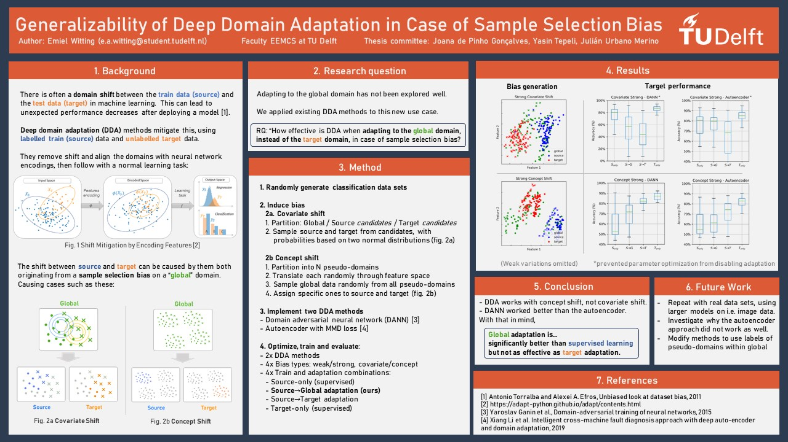

# BSc RP 2023 - Emiel Witting

This code belongs to the CSE3000 Research Project (2023), a bachelor's thesis for Computer Science and Engineering.
Read the paper: http://resolver.tudelft.nl/uuid:c0a7ecc8-efd7-4c36-8f9e-54acd4feaf0e

# Getting started
Use `pip install -r requirements.txt` to install the required dependencies.
The code has been tested with Python 3.11.3.

## Repeating experiments
To repeat the experiments in the paper, run the following files in `/experiments` in this order:

1. generate.py
2. optimize.py
3. validate.py
4. validateextra.py
5. plot.py

The hyperparameter optimization can be followed live with:
    
    pip install optuna-dashboard
    optuna-dashboard sqlite:///db.sqlite3

Find the plots in the results folder.

## Generating Data 
This snippet generates a batch of concept shifted datasets

    import os
    
    from datagen.conceptshift.builder import ConceptShiftDataBuilder
    from datagen.conceptshift.selector import DomainSelector
    from datagen.conceptshift.shifter import Shifter
    from util.batch import batch_generate
    
    batch_path = os.path.join(os.getcwd(), 'results', 'mydata')
    
    init_classification = dict(n_samples=10000, n_features=10, n_informative=10,
                               n_repeated=0, n_redundant=0, n_clusters_per_class=4)
    
    shifter = Shifter(n_domains=4, rot=0, trans=0, scale=0)
    selector = DomainSelector(n_global=100, n_source=100, n_target=100, n_domains_source=1, n_domains_target=1)
    builder = ConceptShiftDataBuilder(init_classification, shifter, selector)
    
    batch_generate(builder, 5, batch_path)

## Evaluating a domain adaptation method
Evaluate domain adaptation methods as follows

    import os
    
    from adapt.feature_based import DANN
    from tensorflow.keras.optimizers.legacy import Adam

    from util.batch import batch_eval
    from models.autoencoder import Autoencoder, default_classifier
    
    batch_path = os.path.join(os.getcwd(), 'results', 'mydata')
    
    model_params = dict(loss="bce", optimizer=Adam(0.001, beta_1=0.5), lambda_=.002, metrics=["acc"], random_state=0,
                        task=default_classifier())
    fit_params = dict(epochs=25,
                      batch_size=16,
                      verbose=0)
    batch_eval(batch_path, DANN, model_params, fit_params, train_split=.7, identifier="DANN")

## Plotting
Results per batch can be visualized with methods in `util/plot.py`

    import os
    
    from util.batch import batch_load_eval
    from util.plot import plot_target_acc_box
    
    batch_path = os.path.join(os.getcwd(), 'results', 'mydata')
    
    # process resulting dataframe
    results = batch_load_eval(batch_path)
    
    # group by identifier and make separate plots
    results = results.groupby('identifier')
    for name, data in results:    
        title = f"Target accuracy of ({name})"
        plot_target_acc_box(data, title)
